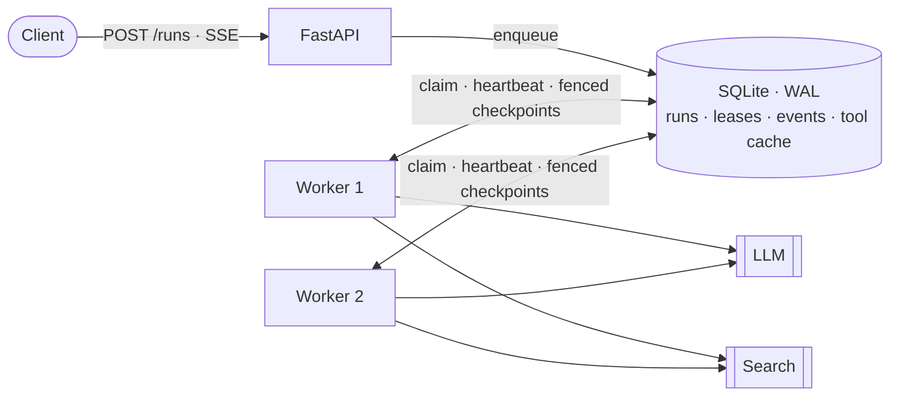

<div align="center">

# 🔁 researchloop

**An evidence-first, resumable research agent.**
<br>
Plan → research in parallel → write a cited report → verify it → repair or dig deeper.

[](https://github.com/limengge426/researchloop/actions/workflows/ci.yml)


</div>

---

Most "deep research" demos generate a report and hope it is right. **researchloop treats the report as a claim that has to pass checks.** Every search hit gets a stable evidence id, every sentence in the report must cite those ids, and a deterministic verifier decides whether the run is done, needs the report rewritten, or needs more research. Runs are checkpointed to SQLite, so a crash, a Ctrl-C or an exhausted budget never throws work away. Behind an HTTP API, any number of workers share the queue: **leases with fencing tokens** make sure each run is driven by one worker at a time, and a dead worker's runs are taken over automatically.

## ✨ Highlights

| | |
|---|---|
| 🧭 **DAG planning** | The planner splits a question into sub-questions with dependencies. Independent tasks run concurrently; dependent tasks receive their prerequisites' findings. Invalid plans (cycles, unknown ids) are rejected and sent back to the model with the error. |
| 🧾 **Evidence ledger** | Search hits are deduplicated and assigned ids (`E1`, `E2`, …). Findings and the report may only cite ledger ids; hallucinated citations are caught and stripped. |
| ✅ **Deterministic verification** | Before finishing, the verifier checks for unknown citations, uncited sections, sub-questions the report ignored, and sub-questions with no evidence. Optionally, an LLM critic looks for coverage gaps. |
| 🔧 **Repair vs. replan** | Report problems trigger a targeted rewrite with the verifier's notes. Evidence gaps trigger a new planning round for just the missing pieces. Both are bounded. |
| 💾 **Crash-safe & resumable** | State is checkpointed after every stage and every wave of tasks. Tool calls are cached by content hash, so a resumed run replays searches instead of repeating them. [Recovers 40/40 hard-killed runs](#-crash-recovery-benchmark) with byte-identical reports. |
| 🔒 **Leased multi-worker execution** | Workers claim runs through time-bound leases renewed by a heartbeat. A dead worker's runs are taken over when its lease expires. Every checkpoint carries a fencing token, so a stalled worker that wakes up after losing its lease cannot overwrite the new owner's progress. |
| 🌐 **HTTP API & Docker** | FastAPI service to submit runs, follow them live over Server-Sent Events (resumable via `Last-Event-ID`) and fetch reports. `docker compose up` starts the API and two worker replicas. |
| 💰 **Hard budgets** | Tokens, tool calls, wall-clock time, replans and repairs are all capped. Hitting a cap *halts* the run cleanly; resume it later with a bigger budget. |
| 🔌 **Bring your own model & search** | Any OpenAI-compatible endpoint (OpenAI, DeepSeek, Qwen, vLLM, Ollama). Search the web with Tavily or a local folder of notes with the built-in BM25 (Chinese supported). |

## 🏗️ How it works


Each research task:

1. writes a few search queries (using upstream findings if it has dependencies),
2. runs them through the search provider (cached, budgeted),
3. adds the hits to the ledger, and
4. summarizes them into a **finding** that cites only its own evidence ids.

The reporter then sees the findings plus only the evidence those findings used, which keeps the prompt small while every claim stays traceable back to a source.

## 🚀 Quick start

```bash
git clone https://github.com/limengge426/researchloop.git
cd researchloop
pip install -e ".[dev]"
```

Point it at any OpenAI-compatible model:

```bash
export RESEARCHLOOP_API_KEY=sk-...
export RESEARCHLOOP_MODEL=gpt-4o-mini                      # or deepseek-chat, qwen-plus, ...
export RESEARCHLOOP_BASE_URL=https://api.openai.com/v1     # or your provider's endpoint
```

**Offline**: research a local folder of `.md` / `.txt` files:

```bash
researchloop run "Are heat pumps worth it in cold climates?" --corpus examples/corpus
```

**Web**: search with [Tavily](https://tavily.com):

```bash
export TAVILY_API_KEY=tvly-...
researchloop run "What changed in EU AI regulation in 2025?" --critic
```

The report is written to `reports/<run_id>.md`, with a **Sources** section listing every cited evidence id.

### Inspect, resume, list

```bash
researchloop show <run_id>                              # event timeline: plan, tool calls, verify, replan…
researchloop resume <run_id> --corpus examples/corpus   # continue after a crash or halt
researchloop resume <run_id> --max-tokens 500000        # …or with a bigger budget
researchloop list
```

<details>
<summary><b>All options</b></summary>

| Option | Default | Meaning |
|---|---|---|
| `--corpus DIR` | — | Search local files instead of the web |
| `--max-tasks` | 5 | Sub-questions in the initial plan |
| `--concurrency` | 3 | Tasks researched in parallel |
| `--max-tokens` | 250,000 | Token budget for the whole run |
| `--max-tool-calls` | 60 | Search budget |
| `--max-minutes` | 30 | Wall-clock budget (summed across resumes) |
| `--max-replans` | 2 | Extra research rounds for evidence gaps |
| `--critic` | off | Ask the LLM to review the report for missing aspects |
| `--lease-ttl` | 30 | Seconds before a dead worker's run is taken over |
| `--db` | `$RESEARCHLOOP_DB` or `researchloop.db` | SQLite file for runs |

</details>

### Run as a service

```bash
pip install -e ".[server]"
researchloop serve --corpus examples/corpus            # API + embedded worker on :8000
```

| Endpoint | |
|---|---|
| `POST /runs` `{"question": "..."}` | Queue a run (202) |
| `GET /runs/{id}` | Status, tasks, evidence count, usage |
| `GET /runs/{id}/events` | Live Server-Sent Events; reconnect with `Last-Event-ID` to resume the stream |
| `GET /runs/{id}/report` | The Markdown report once the run is done |
| `POST /runs/{id}/resume` | Re-queue a run halted by its budget |

Interactive docs are served at `/docs`.

**API and workers as separate processes.** The API only writes runs to the database, and any number of workers execute them:

```bash
researchloop serve --no-worker &
researchloop worker &
researchloop worker &
```

**Docker**: the same topology, one API plus two worker replicas on a shared volume:

```bash
cp .env.example .env    # add your model key
docker compose up --build
```



<details>
<summary><b>How leases and fencing work</b></summary>

<br>

1. A worker claims a run by taking its lease (`BEGIN IMMEDIATE`, so two workers cannot both win). A lease has an owner, an expiry and a **fencing token** that increases with every change of owner.
2. While driving the run, a heartbeat renews the lease every `ttl / 3`.
3. If the worker dies, nobody renews the lease. Once it expires, another worker claims the run with token + 1 and resumes from the last checkpoint.
4. If the old worker was only *paused* (GC pause, suspended VM, blocked event loop) and wakes up later, its next checkpoint is conditioned on its old token and is rejected with `LeaseLost`, so it abandons the run instead of overwriting newer progress.
5. A run that keeps failing (for example because of a bad API key) is marked `failed` after 3 claims instead of being retried forever.

SQLite in WAL mode is safe for several processes on one host (one Docker volume), but not on a network filesystem shared across machines. Scaling beyond one host would mean moving the store to Postgres (`SELECT … FOR UPDATE SKIP LOCKED`).

</details>

### Use as a library

```python
import asyncio
from researchloop import Budget, LocalCorpusSearch, OpenAICompatLLM, ResearchRuntime, RunStore

runtime = ResearchRuntime(
    OpenAICompatLLM.from_env(),
    LocalCorpusSearch("examples/corpus"),
    RunStore("runs.db"),
    budget=Budget(max_tokens=100_000),
)
result = asyncio.run(runtime.start("Are heat pumps worth it in cold climates?"))
print(result.status, result.markdown)
```

## 🧪 Tests

```bash
pytest
```

The suite uses a scripted LLM and a fake search provider, so it runs offline in about two seconds. It covers the scenarios that matter for an agent runtime: parallel waves, dependency hand-off, citation repair, replanning after evidence gaps, one task failing without killing its siblings, **resuming after a hard crash without repeating searches**, halting on budget and resuming with a larger one, HTTP retry/fallback behaviour of the LLM client, the HTTP API and SSE stream, two workers splitting a queue with each run executed once, takeover of an orphaned run, and **a stalled worker being fenced off after another worker takes over its run**.

CI also runs a **deployment drill** ([`evals/deploy_drill.sh`](evals/deploy_drill.sh)): an API and two worker processes against a mock OpenAI-compatible server, with one worker `SIGKILL`ed while it holds a lease. It checks that every run still finishes exactly once. A separate job builds the Docker image and completes a run inside the container.

## 💥 Crash-recovery benchmark

[`evals/crash_recovery.py`](evals/crash_recovery.py) hard-kills (`SIGKILL`) a worker process at **every** LLM call, search call and checkpoint write of a scripted run. The run includes one report repair and one replan, so all four stages are exercised. Fresh processes then resume the run: each one first waits for the killed process's lease to expire, then takes the run over with a new fencing token. Every executed search is written to an fsync'ed side-effect log, so duplicates are counted across processes.

| Scenario | Crashed runs | Recovered | Report byte-identical to uncrashed run | Runs with a duplicate search |
|---|--:|--:|--:|--:|
| Kill before an LLM call | 12 | 12/12 | 12/12 | 0 |
| Kill before a search | 8 | 8/8 | 8/8 | 0 |
| Kill before a checkpoint write | 12 | 12/12 | 12/12 | 0 |
| Kill **after** a search, before its result is cached | 8 | 8/8 | 8/8 | 8 |
| **All single crashes** | **40** | **40/40** | **40/40** | 8 |
| 2–3 crashes in the same run (random) | 30 | 30/30 | 30/30 | 14 |

On average, recovery re-executes **1.0 LLM call** per crash (3.2 when a run crashes 2–3 times).

**Limitation, by design:** tool calls are *at-least-once*, not exactly-once. If the process dies after a search has run but before its result reaches the cache, that search runs again on resume. No local bookkeeping can close this window, because the side effect and the cache write are two separate systems. Exactly-once would need the external service to accept an idempotency key. For read-only search a repeat is harmless; any future tool with side effects would need that key.

```bash
python evals/crash_recovery.py    # 71 scenarios, ~1 min; writes evals/results/
```

## 🗂️ Layout

```text
src/researchloop/
├── runtime.py     # the Plan → Execute → Report → Verify state machine
├── planner.py     # task DAG planning and replanning, with self-correction
├── executor.py    # per-task research, concurrent waves, idempotent tool cache
├── reporter.py    # evidence routing, cited report writing, Markdown rendering
├── verifier.py    # deterministic checks + optional LLM critic
├── ledger.py      # deduplicating evidence ledger
├── budget.py      # budgets and the metered LLM wrapper
├── store.py       # SQLite checkpoints, leases + fencing, event log, tool-call cache
├── worker.py      # claims unowned runs and drives them
├── server.py      # FastAPI app: runs, SSE events, reports
├── search.py      # local BM25 corpus and Tavily web search
├── llm.py         # OpenAI-compatible client, robust JSON extraction
├── prompts.py
└── cli.py
evals/
├── crash_recovery.py   # fault-injection benchmark; results in evals/results/
├── deploy_drill.sh     # API + 2 workers, one SIGKILLed mid-run
└── mock_llm_server.py  # scripted OpenAI-compatible server for end-to-end checks
Dockerfile · docker-compose.yml
```

## 🗺️ Roadmap

- [ ] Postgres store (`FOR UPDATE SKIP LOCKED`) for workers on several hosts
- [ ] Fetch and chunk full web pages instead of relying on search snippets
- [ ] Embedding-based retrieval for local corpora
- [ ] Evaluation harness comparing reports with and without the verify loop

## 🙏 Acknowledgements

The overall design, with a resumable harness, an evidence ledger and a completion check that gates the final report, was inspired by the architecture described in [SichengLong26/deepresearch_agent_harness](https://github.com/SichengLong26/deepresearch_agent_harness). researchloop is an independent, from-scratch implementation with a much smaller scope: a library, CLI and HTTP API, with no web UI, knowledge graph or skill system.

## 📄 License

[MIT](LICENSE)
