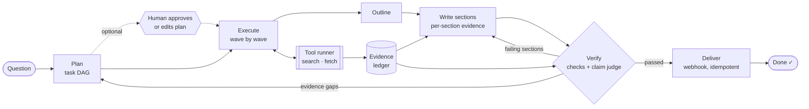
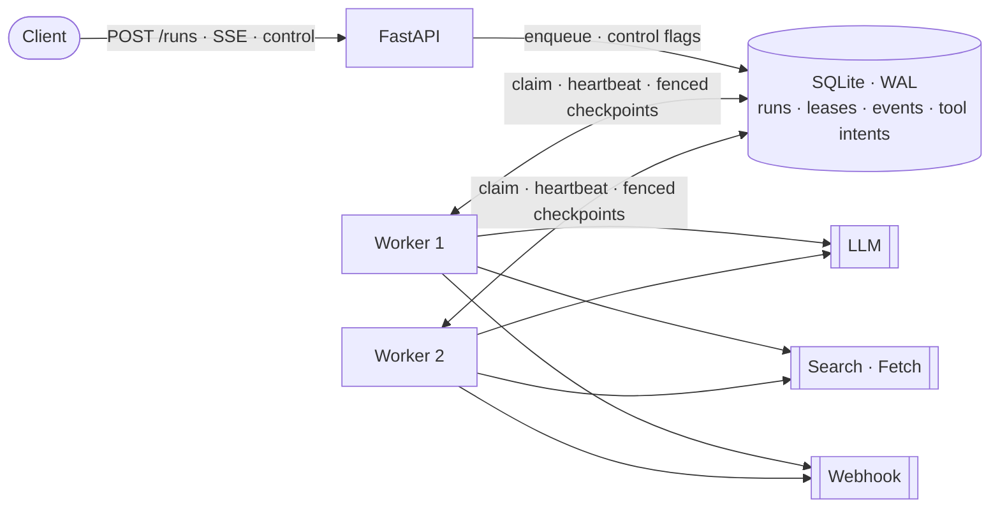

<div align="center">

# 🔍 DeepTrace

**A fault-tolerant deep research agent that traces every claim to its source.**
<br>
Plan → research in parallel → write a cited report → verify every claim → repair or dig deeper → deliver.

[](https://github.com/limengge426/deeptrace-research-agent/actions/workflows/ci.yml)


</div>

---

Most "deep research" demos generate a report and hope it is right. **DeepTrace treats the report as a set of claims that each have to pass checks.** Every source gets a stable evidence id. Every sentence must cite those ids. A judge model then checks each cited sentence against the full text of its sources, and the verifier decides whether the run is done, needs specific sections rewritten, or needs more research.

Around the model sits a harness built for failure. Runs are checkpointed to SQLite and tool calls go through a write-ahead intent log, so crashes never lose work or repeat side effects. Workers coordinate through **leases with fencing tokens**. Humans can **pause, cancel, approve the plan, or reconcile an interrupted side effect**. Every run reports **metrics per stage, per LLM purpose and per tool**.

## ✨ Highlights

| | |
|---|---|
| 🧭 **DAG planning** | The planner splits a question into sub-questions with dependencies. Independent tasks run concurrently; dependent tasks receive their prerequisites' findings. Invalid plans (cycles, unknown ids) are sent back to the model with the error. |
| 🧾 **Evidence ledger** | Every source is deduplicated and gets an id (`E1`, `E2`, …). Findings and the report may only cite ledger ids. |
| 🔍 **Claim-level faithfulness** | Each cited sentence is judged against the full text of the evidence it cites (supported / partial / unsupported / contradicted). Failing claims become precise repair notes, and whatever is still unsupported after repair is listed under *Limitations* instead of being hidden. The judge can be a separate model, so the writer does not grade itself. |
| ✅ **Deterministic checks** | Unknown citations, uncited sections, **figures stated without a citation**, sub-questions the report ignored, and sub-questions with no evidence. |
| 🧩 **Sectioned context engineering** | An outline assigns findings to sections, with a deterministic check that no finding is dropped. Each section is written from **only its own evidence**. Evidence over a section's context budget is condensed into cited notes first. Repairs **rewrite only the sections that failed**. |
| 🔧 **Repair vs. replan** | Report problems trigger targeted rewrites. Evidence gaps trigger a new planning round for just the missing pieces. Both are bounded. |
| 💾 **Crash-safe tool layer** | Every tool call is recorded as an intent before it runs and as a result after. On resume, read-only calls are replayed or retried. Side-effecting calls are retried **with the same idempotency key**, or held for a human if the tool has no idempotency support. [82/82 hard-killed runs recovered, every report delivered exactly once](#-crash-recovery-benchmark). |
| 🔒 **Leased multi-worker execution** | Workers claim runs through heartbeat-renewed leases. A dead worker's runs are taken over when its lease expires. Every checkpoint carries a fencing token, so a stalled worker cannot overwrite the new owner's progress. |
| 🙋 **Human control** | Cancel or pause a run (applied at the next step boundary), resume it later, require **plan approval** (approve as proposed or submit an edited DAG), and reconcile interrupted side effects. |
| 📈 **Observability** | Tokens, calls, latency and errors per LLM purpose; calls and cache hits per tool; time per stage. Available per run and aggregated (P50/P95, faithfulness), also in Prometheus format. Live progress over Server-Sent Events. |
| 🌐 **HTTP API & Docker** | FastAPI service; `docker compose up` starts the API plus two worker replicas. |
| 🔌 **Bring your own model & search** | Any OpenAI-compatible endpoint (OpenAI, DeepSeek, Qwen, vLLM, Ollama). Web search (Tavily) with **full-page fetching** of the top hits, or a local folder with the built-in BM25 (Chinese supported). |

## 🏗️ How it works



Each research task:

1. writes a few search queries (using upstream findings if it has dependencies),
2. runs them through the tool runner (budgeted, recorded, replayed after crashes),
3. for web hits, fetches the top pages and keeps the passages most relevant to the question,
4. adds the evidence to the ledger, and
5. summarizes it into a **finding** that cites only its own evidence ids.

The reporter then plans an outline over the findings and writes each section from only the evidence its findings used, so no prompt carries the whole evidence set.

## 🚀 Quick start

```bash
git clone https://github.com/limengge426/deeptrace_agent.git
cd deeptrace-research-agent
pip install -e ".[dev]"
```

Point it at any OpenAI-compatible model (or put these lines in a `.env` file):

```bash
export DEEPTRACE_API_KEY=sk-...
export DEEPTRACE_MODEL=gpt-4o-mini                      # or deepseek-chat, qwen-plus, ...
export DEEPTRACE_BASE_URL=https://api.openai.com/v1     # or your provider's endpoint
```

**Offline**: research a local folder of `.md` / `.txt` files:

```bash
deeptrace run "Are heat pumps worth it in cold climates?" --corpus examples/corpus
```

**Web**: search with [Tavily](https://tavily.com); the top hits of each query are fetched in full:

```bash
export TAVILY_API_KEY=tvly-...
deeptrace run "What changed in EU AI regulation in 2025?" --critic
```

The report is written to `reports/<run_id>.md`, with a **Sources** section listing every cited evidence id and a **Limitations** section for anything that could not be verified.

### Inspect and control runs

```bash
deeptrace show <run_id>                   # event timeline + metrics per LLM purpose, stage and tool
deeptrace list

deeptrace run "..." --approve-plan        # stop after planning; prints the proposed DAG
deeptrace approve <run_id> [--plan edited.json]
deeptrace resume <run_id>                 # continue after approval, a pause, a halt or a crash

deeptrace pause <run_id>                  # applied at the next step boundary
deeptrace cancel <run_id>

deeptrace run "..." --webhook https://hooks.example/report   # deliver the finished report
deeptrace resolve <run_id>                                    # list interrupted side-effecting calls
deeptrace resolve <run_id> <key> --outcome done|retry         # reconcile one of them
```

<details>
<summary><b>All run options</b></summary>

| Option | Default | Meaning |
|---|---|---|
| `--corpus DIR` | `$DEEPTRACE_CORPUS` | Search local files instead of the web |
| `--max-tasks` | 5 | Sub-questions in the initial plan |
| `--concurrency` | 3 | Tasks researched in parallel |
| `--fetch-pages` | 2 | Web hits per query fetched in full |
| `--max-tokens` | 250,000 | Token budget for the whole run |
| `--max-tool-calls` | 60 | Tool call budget (searches and fetches) |
| `--max-minutes` | 30 | Wall-clock budget (summed across resumes) |
| `--max-replans` | 2 | Extra research rounds for evidence gaps |
| `--critic` | off | Ask the LLM to review the report for missing aspects |
| `--lease-ttl` | 30 | Seconds before a dead worker's run is taken over |
| `--db` | `$DEEPTRACE_DB` or `deeptrace.db` | SQLite file for runs |

</details>

### Run as a service

```bash
pip install -e ".[server]"
deeptrace serve --corpus examples/corpus            # API + embedded worker on :8000
```

| Endpoint | |
|---|---|
| `POST /runs` `{"question", "approve_plan"?, "webhook_url"?}` | Queue a run (202) |
| `GET /runs/{id}` | Status, tasks, evidence count, usage, delivery |
| `GET /runs/{id}/events` | Live Server-Sent Events; reconnect with `Last-Event-ID` to resume the stream |
| `GET /runs/{id}/report` | The Markdown report once the run is done |
| `GET /runs/{id}/metrics` | LLM usage per purpose, tool calls and cache hits, time per stage, faithfulness |
| `POST /runs/{id}/pause` · `/cancel` · `/resume` | Human control |
| `POST /runs/{id}/plan/approve` `{"tasks"?}` | Approve the proposed plan, or replace it with an edited DAG |
| `GET /runs/{id}/tool-calls/pending` | Side-effecting calls interrupted mid-flight |
| `POST /runs/{id}/tool-calls/{key}/resolve` `{"outcome": "done" \| "retry"}` | Reconcile one |
| `GET /metrics` `?format=prometheus` | Aggregates across runs (status counts, P50/P95, cache hit rate, faithfulness) |

Interactive docs are served at `/docs`.

**API and workers as separate processes.** The API only writes runs to the database, and any number of workers execute them:

```bash
deeptrace serve --no-worker &
deeptrace worker &
deeptrace worker &
```

**Docker**: the same topology, one API plus two worker replicas on a shared volume:

```bash
cp .env.example .env    # add your model key
docker compose up --build
```



<details>
<summary><b>How leases and fencing work</b></summary>

<br>

1. A worker claims a run by taking its lease (`BEGIN IMMEDIATE`, so two workers cannot both win). A lease has an owner, an expiry and a **fencing token** that increases with every change of owner.
2. While driving the run, a heartbeat renews the lease every `ttl / 3`.
3. If the worker dies, nobody renews the lease. Once it expires, another worker claims the run with token + 1 and resumes from the last checkpoint.
4. If the old worker was only *paused* (GC pause, suspended VM, blocked event loop) and wakes up later, its next checkpoint is conditioned on its old token and is rejected with `LeaseLost`, so it abandons the run instead of overwriting newer progress.
5. A run that keeps failing (for example because of a bad API key) is marked `failed` after 3 claims instead of being retried forever.

SQLite in WAL mode is safe for several processes on one host (one Docker volume), but not on a network filesystem shared across machines. Scaling beyond one host would mean moving the store to Postgres (`SELECT … FOR UPDATE SKIP LOCKED`).

</details>

<details>
<summary><b>How the tool layer handles crashes</b></summary>

<br>

Every tool declares whether it has side effects and whether its receiver deduplicates by idempotency key. The runner writes a `pending` intent **before** each call and the result **after** it. On resume:

| Record found | Tool | What happens |
|---|---|---|
| `done` | any | The recorded result is replayed; nothing is called |
| `pending` | read-only (search, fetch) | Called again; a repeat is harmless |
| `pending` | side effects + idempotency key (webhook) | Called again **with the same key**; the receiver drops the duplicate |
| `pending` | side effects, no idempotency support | **Not** retried; the run is held as `needs_reconciliation` until a human says whether it happened |

No local bookkeeping can make an external side effect exactly-once on its own: the call and the local write are two separate systems. The intent log makes every possible duplicate *detectable*, and idempotency keys let the receiver make it *harmless*.

</details>

### Use as a library

```python
import asyncio
from deeptrace_agent import Budget, LocalCorpusSearch, OpenAICompatLLM, ResearchRuntime, RunStore

runtime = ResearchRuntime(
    OpenAICompatLLM.from_env(),
    LocalCorpusSearch("examples/corpus"),
    RunStore("runs.db"),
    budget=Budget(max_tokens=100_000),
    judge_llm=None,          # or a separate (stronger) model for the faithfulness judge
    report_mode="sections",  # or "single" for the one-shot baseline
)
result = asyncio.run(runtime.start("Are heat pumps worth it in cold climates?"))
print(result.status, result.markdown)
```

## 🧪 Tests

```bash
pytest
```

80 tests, using a scripted LLM and a fake search provider, run offline in a few seconds. They cover:

- **Planning and repair**: parallel waves, dependency hand-off, citation repair, replanning after evidence gaps, one task failing without killing its siblings.
- **Faithfulness**: claim extraction (including Chinese text and trailing citations), judge fail-closed behaviour, and repair of only the section holding a bad claim.
- **Context engineering**: outline coverage repair, per-section evidence routing, condensing over-budget evidence.
- **Crash recovery**: resuming after a hard crash without repeating searches, budget halt and resume.
- **Workers and leases**: two workers splitting a queue, orphaned-run takeover, and **a stalled worker fenced off after another worker takes over**.
- **Human control**: cancel, pause and resume, plan approval with edited DAGs.
- **Tool layer**: replay, retry with the same key, reconciliation holds, page fetching, idempotent delivery.
- **API, SSE and metrics**.

CI also runs a **deployment drill** ([`evals/deploy_drill.sh`](evals/deploy_drill.sh)): an API and two worker processes against a mock OpenAI-compatible server, with one worker `SIGKILL`ed while it holds a lease; every run must still finish exactly once. A separate job builds the Docker image and completes a run inside the container.

## 💥 Crash-recovery benchmark

[`evals/crash_recovery.py`](evals/crash_recovery.py) hard-kills (`SIGKILL`) a worker process at **every** LLM call, search call, checkpoint write and webhook delivery of a scripted run. The run includes a section repair, a replan and delivery of the report to a webhook, so every stage is exercised. Fresh processes then resume the run: each one waits for the killed process's lease to expire and takes the run over with a new fencing token. Every executed search and every webhook send is written to an fsync'ed side-effect log, so duplicates are counted across processes. The simulated receiver honors `Idempotency-Key`, as Stripe-style APIs do.

| Scenario | Crashed runs | Recovered | Report byte-identical to uncrashed run | Runs with a repeated search | Report delivered exactly once |
|---|--:|--:|--:|--:|--:|
| Kill before an LLM call | 21 | 21/21 | 21/21 | 0 | 21/21 |
| Kill before a search | 8 | 8/8 | 8/8 | 0 | 8/8 |
| Kill **after** a search, before its result is recorded | 8 | 8/8 | 8/8 | 8 | 8/8 |
| Kill before a checkpoint write | 13 | 13/13 | 13/13 | 0 | 13/13 |
| Kill before / **after** the webhook POST | 2 | 2/2 | 2/2 | 0 | 2/2 (1 re-send, deduplicated) |
| **All single crashes** | **52** | **52/52** | **52/52** | 8 | **52/52** |
| 2–3 crashes in the same run (random) | 30 | 30/30 | 30/30 | 5 | 30/30 (9 re-sends, deduplicated) |

On average, recovery re-executes **1.3 LLM calls** per crash (2.0 when a run crashes 2–3 times).

**What the numbers mean:** read-only searches are *at-least-once*: a crash between a search and the recording of its result repeats that search, which is harmless. The side-effecting delivery is also sent again after such a crash, but with the same idempotency key, so the receiver processes it **exactly once in 82/82 crashed runs**. Replacing the stable key with a random one makes the same benchmark report a duplicate delivery. Usage counters (tokens, calls) are checkpointed with the run, so work done after the last checkpoint of a crashed process is not counted.

```bash
python evals/crash_recovery.py    # 83 scenarios, ~1 min; writes evals/results/
```

## 🎯 Real-model evaluation

[`evals/faithfulness_eval.py`](evals/faithfulness_eval.py) runs 24 research questions over 40 Wikipedia articles pinned to fixed revisions ([manifest](evals/data/wikipedia_manifest.json)). The writer and the in-loop judge are `gpt-4o-mini`. An independent `gpt-4o` grader labels every cited claim of every final report against the full text of its evidence. Full results: [`evals/results/faithfulness_eval.md`](evals/results/faithfulness_eval.md).

**The claim judge catches injected faults.** Faults were injected into claims the grader had labeled *supported*, and only faults the grader confirmed were kept:

| Injected fault | Cases | Caught by the in-loop judge (95% CI) |
|---|--:|--:|
| Citation swapped to unrelated evidence | 132 | **99.2%** (95.8–99.9) |
| Minimal factual edit (a number, entity or direction) | 54 | **100%** flagged (93.4–100); 74.1% as unsupported/contradicted, the rest as *partial* |
| False alarms on untouched supported claims | 129 | **0.0%** (0.0–2.9) |

**Sectioned writing bounds the context of every call.** The largest report-stage call was smaller for **24/24** questions (median **−41%**). The cost is more calls: total tokens per run rose 21%.

**Not yet shown: better final reports.** On this clean corpus the baseline already has few unsupported claims (3.3%). With the judge in the loop that fell to 2.2%, but the paired bootstrap interval (−5.3 to +4.0 points) includes zero. The detection results point to the cause: the loop only repairs *unsupported* and *contradicted* claims, while a quarter of injected factual edits are labeled *partial*. Repairing *partial* claims is the next change, to be evaluated on held-out questions.

```bash
python evals/fetch_wikipedia.py                          # 40 pinned articles, ~2 MB (text not committed: CC BY-SA)
python evals/faithfulness_eval.py runs grade detect report
```

## 🗂️ Layout

```text
src/deeptrace_agent/
├── runtime.py       # the Plan → Execute → Report → Verify → Deliver state machine, human control
├── planner.py       # task DAG planning and replanning, with self-correction
├── executor.py      # per-task research, concurrent waves, page enrichment
├── tools.py         # tool runner with write-ahead intents; search, fetch and webhook tools
├── reporter.py      # outline, per-section evidence routing, condensing, targeted repair
├── faithfulness.py  # claim extraction and the claim-vs-evidence judge
├── verifier.py      # deterministic checks + optional LLM critic
├── ledger.py        # deduplicating evidence ledger
├── budget.py        # budgets and the metered LLM wrapper
├── metrics.py       # per-run metrics, aggregation, Prometheus rendering
├── store.py         # SQLite: checkpoints, leases + fencing, control flags, events, tool intents
├── worker.py        # claims unowned runs and drives them
├── server.py        # FastAPI app
├── search.py        # local BM25 corpus and Tavily web search
├── llm.py           # OpenAI-compatible client, rate-limit aware retries, robust JSON extraction
├── env.py           # DEEPTRACE_* configuration
├── prompts.py
└── cli.py
evals/
├── crash_recovery.py   # fault-injection benchmark; results in evals/results/
├── faithfulness_eval.py  # real-model evaluation on pinned Wikipedia articles
├── fetch_wikipedia.py  # builds the pinned evaluation corpus
├── deploy_drill.sh     # API + 2 workers, one SIGKILLed mid-run
└── mock_llm_server.py  # scripted OpenAI-compatible server for end-to-end checks
Dockerfile · docker-compose.yml
```

## 🗺️ Roadmap

- [x] Evaluation on a fixed corpus with real models ([results](evals/results/faithfulness_eval.md))
- [ ] Repair *partial* claims too, evaluated on held-out questions
- [ ] Novelty-based early stopping for research rounds
- [ ] Contradiction detection across sources
- [ ] Postgres store (`FOR UPDATE SKIP LOCKED`) for workers on several hosts

## 🙏 Acknowledgements

The overall design, with a resumable harness, an evidence ledger and a completion check that gates the final report, was inspired by the architecture described in [SichengLong26/deepresearch_agent_harness](https://github.com/SichengLong26/deepresearch_agent_harness). DeepTrace is an independent, from-scratch implementation with a different scope: a library, CLI and HTTP API, with no web UI, knowledge graph or skill system. Its claim-level faithfulness judge targets a gap the original's own documentation names: its claim-support metric is a deterministic proxy, not a semantic check.

## 📄 License


[MIT](LICENSE)

<sub>DeepTrace was previously named *researchloop*.</sub>
