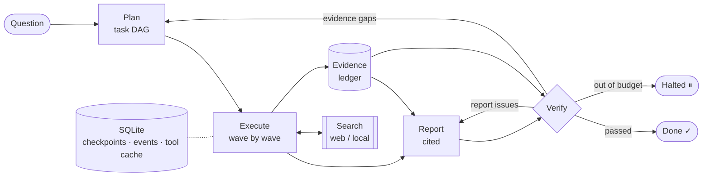

<div align="center">

# 🔁 researchloop

**An evidence-first, resumable research agent.**
<br>
Plan → research in parallel → write a cited report → verify it → repair or dig deeper.

[](https://github.com/limengge426/researchloop/actions/workflows/ci.yml)


</div>

---

Most "deep research" demos generate a report and hope it is right. **researchloop treats the report as a claim that has to pass checks.** Every search hit gets a stable evidence id, every sentence in the report must cite those ids, and a deterministic verifier decides whether the run is done, needs the report rewritten, or needs more research. Runs are checkpointed to SQLite, so a crash, a Ctrl-C or an exhausted budget never throws work away.

## ✨ Highlights

| | |
|---|---|
| 🧭 **DAG planning** | The planner splits a question into sub-questions with dependencies. Independent tasks run concurrently; dependent tasks receive their prerequisites' findings. Invalid plans (cycles, unknown ids) are rejected and sent back to the model with the error. |
| 🧾 **Evidence ledger** | Search hits are deduplicated and assigned ids (`E1`, `E2`, …). Findings and the report may only cite ledger ids; hallucinated citations are caught and stripped. |
| ✅ **Deterministic verification** | Before finishing, the verifier checks for unknown citations, uncited sections, sub-questions the report ignored, and sub-questions with no evidence. Optionally, an LLM critic looks for coverage gaps. |
| 🔧 **Repair vs. replan** | Report problems trigger a targeted rewrite with the verifier's notes. Evidence gaps trigger a new planning round for just the missing pieces. Both are bounded. |
| 💾 **Crash-safe & resumable** | State is checkpointed after every stage and every wave of tasks. Tool calls are cached by content hash, so a resumed run replays searches instead of repeating them. |
| 💰 **Hard budgets** | Tokens, tool calls, wall-clock time, replans and repairs are all capped. Hitting a cap *halts* the run cleanly; resume it later with a bigger budget. |
| 🔌 **Bring your own model & search** | Any OpenAI-compatible endpoint (OpenAI, DeepSeek, Qwen, vLLM, Ollama). Search the web with Tavily or a local folder of notes with the built-in BM25 (Chinese supported). |

## 🏗️ How it works



Each research task:

1. writes a few search queries (using upstream findings if it has dependencies),
2. runs them through the search provider (cached, budgeted),
3. adds the hits to the ledger, and
4. summarizes them into a **finding** that cites only its own evidence ids.

The reporter then sees the findings plus only the evidence those findings used, which keeps the prompt small while every claim stays traceable back to a source.

## 🚀 Quick start

```bash
git clone https://github.com/limengge426/researchloop.git
cd researchloop
pip install -e ".[dev]"
```

Point it at any OpenAI-compatible model:

```bash
export RESEARCHLOOP_API_KEY=sk-...
export RESEARCHLOOP_MODEL=gpt-4o-mini                      # or deepseek-chat, qwen-plus, ...
export RESEARCHLOOP_BASE_URL=https://api.openai.com/v1     # or your provider's endpoint
```

**Offline**: research a local folder of `.md` / `.txt` files:

```bash
researchloop run "Are heat pumps worth it in cold climates?" --corpus examples/corpus
```

**Web**: search with [Tavily](https://tavily.com):

```bash
export TAVILY_API_KEY=tvly-...
researchloop run "What changed in EU AI regulation in 2025?" --critic
```

The report is written to `reports/<run_id>.md`, with a **Sources** section listing every cited evidence id.

### Inspect, resume, list

```bash
researchloop show <run_id>                              # event timeline: plan, tool calls, verify, replan…
researchloop resume <run_id> --corpus examples/corpus   # continue after a crash or halt
researchloop resume <run_id> --max-tokens 500000        # …or with a bigger budget
researchloop list
```

<details>
<summary><b>All options</b></summary>

| Option | Default | Meaning |
|---|---|---|
| `--corpus DIR` | — | Search local files instead of the web |
| `--max-tasks` | 5 | Sub-questions in the initial plan |
| `--concurrency` | 3 | Tasks researched in parallel |
| `--max-tokens` | 250,000 | Token budget for the whole run |
| `--max-tool-calls` | 60 | Search budget |
| `--max-minutes` | 30 | Wall-clock budget (summed across resumes) |
| `--max-replans` | 2 | Extra research rounds for evidence gaps |
| `--critic` | off | Ask the LLM to review the report for missing aspects |
| `--db` | `researchloop.db` | SQLite file for runs |

</details>

### Use as a library

```python
import asyncio
from researchloop import Budget, LocalCorpusSearch, OpenAICompatLLM, ResearchRuntime, RunStore

runtime = ResearchRuntime(
    OpenAICompatLLM.from_env(),
    LocalCorpusSearch("examples/corpus"),
    RunStore("runs.db"),
    budget=Budget(max_tokens=100_000),
)
result = asyncio.run(runtime.start("Are heat pumps worth it in cold climates?"))
print(result.status, result.markdown)
```

## 🧪 Tests

```bash
pytest
```

The suite uses a scripted LLM and a fake search provider, so it runs offline in under a second. It covers the scenarios that matter for an agent runtime: parallel waves, dependency hand-off, citation repair, replanning after evidence gaps, one task failing without killing its siblings, **resuming after a hard crash without repeating searches**, halting on budget and resuming with a larger one, and HTTP retry/fallback behaviour of the LLM client.

## 🗂️ Layout

```text
src/researchloop/
├── runtime.py     # the Plan → Execute → Report → Verify state machine
├── planner.py     # task DAG planning and replanning, with self-correction
├── executor.py    # per-task research, concurrent waves, idempotent tool cache
├── reporter.py    # evidence routing, cited report writing, Markdown rendering
├── verifier.py    # deterministic checks + optional LLM critic
├── ledger.py      # deduplicating evidence ledger
├── budget.py      # budgets and the metered LLM wrapper
├── store.py       # SQLite checkpoints, event log, tool-call cache
├── search.py      # local BM25 corpus and Tavily web search
├── llm.py         # OpenAI-compatible client, robust JSON extraction
├── prompts.py
└── cli.py
```

## 🗺️ Roadmap

- [ ] Stream events to the terminal while a run is in progress
- [ ] Fetch and chunk full web pages instead of relying on search snippets
- [ ] Embedding-based retrieval for local corpora
- [ ] Evaluation harness comparing reports with and without the verify loop

## 🙏 Acknowledgements

The overall design, with a resumable harness, an evidence ledger and a completion check that gates the final report, was inspired by the architecture described in [SichengLong26/deepresearch_agent_harness](https://github.com/SichengLong26/deepresearch_agent_harness). researchloop is an independent, from-scratch implementation with a much smaller scope: a CLI and library with no web UI, knowledge graph or skill system.

## 📄 License

[MIT](LICENSE)
