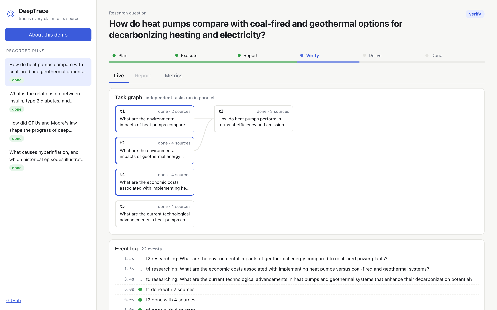
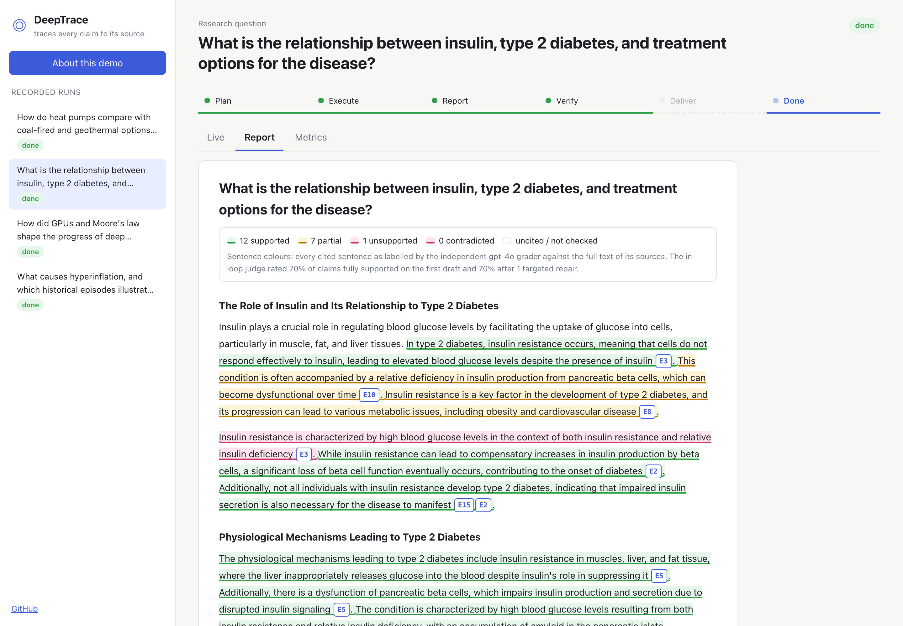
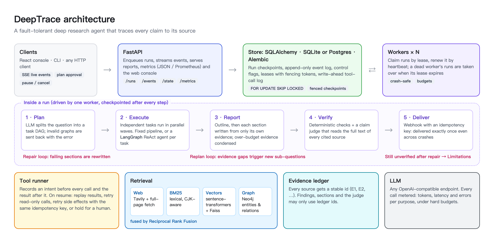

<div align="center">

# 🔍 DeepTrace

**A fault-tolerant deep research agent that traces every claim to its source.**

English · [简体中文](README.zh-CN.md)

[](https://github.com/limengge426/deeptrace-research-agent/actions/workflows/ci.yml)


**[▶ Live demo](https://limengge426.github.io/deeptrace-research-agent/)** · [Features](docs/features.md) · [Evaluation](docs/evaluation.md) · [Usage](docs/usage.md) · [Design](docs/design.md)

</div>

<p align="center">
   
</p>

Most deep research agents write a report and hope it is right. **DeepTrace treats every sentence as a claim that has to pass checks.** Each source gets a stable evidence id. A judge model reads the full text of every cited source and flags claims it does not support. Failing sections are rewritten, and evidence gaps trigger more research. Around the model sits a harness built for failure: checkpoints, leases with fencing tokens, and a write-ahead tool-call log. Crashes lose no work and never repeat a side effect.

## Results

All measured by scripts in [`evals/`](evals/), on a pinned Wikipedia corpus with an independent `gpt-4o` grader. Details and confidence intervals: [docs/evaluation.md](docs/evaluation.md).

| | |
|---|---|
| **82/82** hard-killed runs recovered | byte-identical reports, webhook report delivered exactly once |
| **99.2%** of swapped citations caught | claim judge flags **100%** of injected factual edits, **0/129** false alarms |
| **−62%** cumulative evidence in prompts | per-section routing vs. all-evidence prompts; **−20%** total tokens |
| **100%** of findings cited | enforced by the verifier |

## How it works

<p align="center"></p>

## Quick start

```bash
git clone https://github.com/limengge426/deeptrace-research-agent.git && cd deeptrace-research-agent
pip install -e ".[server]"
export DEEPTRACE_API_KEY=sk-...              # any OpenAI-compatible endpoint (DEEPTRACE_BASE_URL, DEEPTRACE_MODEL)

deeptrace run "Are heat pumps worth it in cold climates?" --corpus examples/corpus
deeptrace ask <run_id> "What about running costs?" --corpus examples/corpus   # follow-up, reuses the evidence
deeptrace serve --corpus examples/corpus     # web console at http://127.0.0.1:8000 (build it once: cd web && npm i && npm run build)
docker compose up --build                    # API + two workers, optional Postgres / Neo4j profiles
```

More: [web search, hybrid retrieval, the LangGraph agent, plan approval, the HTTP API](docs/usage.md).

## Tech stack

| Layer | |
|---|---|
| Agent | LangGraph + LangChain, OpenAI-compatible API |
| Harness | asyncio state machine, checkpoints, leases + fencing tokens, write-ahead tool-call log, budgets |
| Retrieval | Tavily + page fetch, BM25, sentence-transformers + Faiss, Neo4j knowledge graph, Reciprocal Rank Fusion |
| Storage | SQLAlchemy (SQLite / Postgres), Alembic |
| API / UI | FastAPI + Server-Sent Events, React + TypeScript |
| Ops | Docker Compose, Prometheus metrics, GitHub Actions (SQLite, Postgres and Neo4j jobs), GitHub Pages |


## License

[MIT](LICENSE). The demo data in `web/public/demo/` contains Wikipedia excerpts (CC BY-SA 4.0), each linked to its source revision.

<sub>DeepTrace was previously named *researchloop*.</sub>
