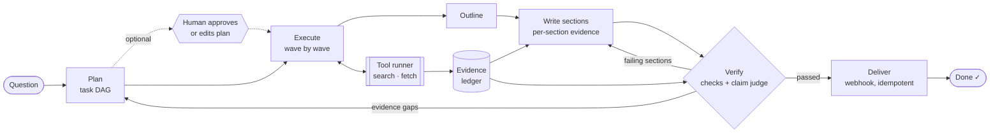

# Features

[← Back to README](../README.md)

## ✨ Highlights

| | |
|---|---|
| 🧭 **DAG planning** | The planner splits a question into sub-questions with dependencies. Independent tasks run concurrently; dependent tasks receive their prerequisites' findings. Invalid plans (cycles, unknown ids) are sent back to the model with the error. |
| 🧾 **Evidence ledger** | Every source is deduplicated and gets an id (`E1`, `E2`, …). Findings and the report may only cite ledger ids. |
| 🔍 **Claim-level faithfulness** | Each cited sentence is judged against the full text of the evidence it cites (supported / partial / unsupported / contradicted). Failing claims become precise repair notes, and whatever is still unsupported after repair is listed under *Limitations* instead of being hidden. The judge can be a separate model, so the writer does not grade itself. |
| ✅ **Deterministic checks** | Unknown citations, uncited sections, **figures stated without a citation**, sub-questions the report ignored, and sub-questions with no evidence. |
| 🧩 **Sectioned context engineering** | An outline assigns findings to sections, with a deterministic check that no finding is dropped. Each section is written from **only its own evidence**. Evidence over a section's context budget is condensed into cited notes first. Repairs **rewrite only the sections that failed**. |
| 🔧 **Repair vs. replan** | Report problems trigger targeted rewrites. Evidence gaps trigger a new planning round for just the missing pieces. Both are bounded. |
| 💾 **Crash-safe tool layer** | Every tool call is recorded as an intent before it runs and as a result after. On resume, read-only calls are replayed or retried. Side-effecting calls are retried **with the same idempotency key**, or held for a human if the tool has no idempotency support. [82/82 hard-killed runs recovered, every report delivered exactly once](evaluation.md#-crash-recovery-benchmark). |
| 🔒 **Leased multi-worker execution** | Workers claim runs through heartbeat-renewed leases. A dead worker's runs are taken over when its lease expires. Every checkpoint carries a fencing token, so a stalled worker cannot overwrite the new owner's progress. |
| 🙋 **Human control** | Cancel or pause a run (applied at the next step boundary), resume it later, require **plan approval** (approve as proposed or submit an edited DAG), and reconcile interrupted side effects. |
| 📈 **Observability** | Tokens, calls, latency and errors per LLM purpose; calls and cache hits per tool; time per stage. Available per run and aggregated (P50/P95, faithfulness), also in Prometheus format. Live progress over Server-Sent Events. |
| 🖥️ **Web console** | React + TypeScript console: watch the task graph fill in live, review and edit the plan before research starts, and read reports where **every cited sentence is coloured by how well its source supports it**. Click any citation to see the source text and every sentence that relies on it. |
| 🌐 **HTTP API & Docker** | FastAPI service; `docker compose up` starts the API plus two worker replicas, with the console served at `/`. |
| 🤖 **Agentic research (LangGraph)** | Optionally, each sub-question is researched by a LangGraph ReAct agent that decides what to search, refines queries and stops when it has enough evidence. Its tool calls still go through the crash-safe tool runner, its sources still enter the ledger, and its tokens are metered by a LangChain callback into the same budget. |
| 🔎 **Hybrid retrieval: BM25 + vectors + knowledge graph** | Sentence-transformer embeddings in a Faiss index, and a Neo4j knowledge graph (entities, relations, entity-linked expansion), fused with BM25 by Reciprocal Rank Fusion. [Evaluated on hand-labelled queries](evaluation.md#-retrieval). |
| 🗄️ **Portable storage (SQLAlchemy + Alembic)** | SQLite by default or Postgres for workers on several hosts (leases use `FOR UPDATE SKIP LOCKED`). The schema is versioned with Alembic, and databases created by older versions are adopted automatically. |
| 🔌 **Bring your own model & search** | Any OpenAI-compatible endpoint (OpenAI, DeepSeek, Qwen, vLLM, Ollama). Web search (Tavily) with **full-page fetching** of the top hits, or a local folder (Chinese supported). |

## 🏗️ How it works

Each research task:

1. writes a few search queries (using upstream findings if it has dependencies),
2. runs them through the tool runner (budgeted, recorded, replayed after crashes),
3. for web hits, fetches the top pages and keeps the passages most relevant to the question,
4. adds the evidence to the ledger, and
5. summarizes it into a **finding** that cites only its own evidence ids.

The reporter then plans an outline over the findings and writes each section from only the evidence its findings used, so no prompt carries the whole evidence set.
