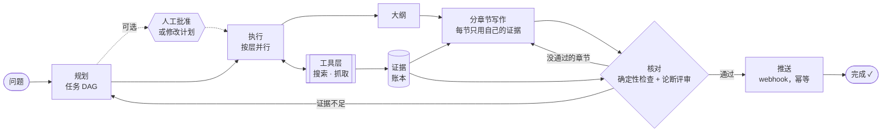

# 功能

[← 返回 README](../../README.zh-CN.md) · [English](../features.md)

## ✨ 亮点

| | |
|---|---|
| 🧭 **DAG 规划** | 规划器把问题拆成带依赖关系的子问题。互不依赖的任务并发执行，有依赖的任务会拿到前置任务的研究发现。不合法的计划（有环、引用不存在的 id）会连同错误信息一起退回给模型重做。 |
| 🧾 **证据账本** | 每个来源都会去重并分配一个编号（`E1`、`E2`……）。研究发现和报告只能引用账本里的编号。 |
| 🔍 **论断级忠实度** | 每一句带引用的话，都会对照它所引用证据的全文来评判（完全支持 / 部分支持 / 不支持 / 矛盾）。没通过的论断会变成精确的修复说明；修复后仍不被支持的内容会列在 *局限* 一节，而不是被藏起来。评审可以用另一个模型，这样写作者不必给自己打分。 |
| ✅ **确定性检查** | 引用了不存在的来源、整节没有引用、**给出数字却不注明来源**、报告忽略了某个子问题、某个子问题没有找到证据。 |
| 🧩 **分章节的上下文工程** | 先列大纲，把研究发现分配到各章节，并用确定性检查保证没有发现被遗漏。每一节**只用它自己的证据**来写。超出章节上下文预算的证据会先被压缩成带引用的笔记。修复时**只重写没通过的章节**。 |
| 🔧 **修复 vs. 重新规划** | 报告本身的问题触发定向重写；证据不足则只针对缺失的部分发起新一轮规划。两者都有次数上限。 |
| 💾 **崩溃安全的工具层** | 每次工具调用在执行前记录意图、执行后记录结果。恢复时，只读调用会被重放或重试；有副作用的调用会**用同一个幂等键**重试，如果该工具不支持幂等，则暂停等待人工确认。[82/82 次强制杀进程的运行全部恢复，每份报告都恰好送达一次](evaluation.md#-崩溃恢复基准)。 |
| 🔒 **基于租约的多 worker 执行** | worker 通过带心跳续期的租约认领运行。worker 挂掉后，它的租约过期，运行会被其他 worker 接管。每个检查点都带有 fencing token，卡住后醒来的旧 worker 无法覆盖新 owner 的进度。 |
| 🙋 **人工控制** | 取消或暂停运行（在下一个步骤边界生效）、之后再继续、要求**计划审批**（按原计划批准或提交修改后的 DAG），以及核对被中断的副作用操作。 |
| 📈 **可观测性** | 按 LLM 调用目的统计 token、调用次数、延迟和错误；按工具统计调用次数和缓存命中；各阶段耗时。既有单次运行的数据，也有跨运行的汇总（P50/P95、忠实度），并提供 Prometheus 格式。通过 Server-Sent Events 实时推送进度。 |
| 🖥️ **网页控制台** | React + TypeScript 控制台：实时观看任务图逐步完成，研究开始前审阅和修改计划，阅读报告时**每一句带引用的话都按来源支持程度着色**。点击任意引用，可以看到来源原文以及所有依赖它的句子。界面支持中文和英文。 |
| 🌐 **HTTP API 与 Docker** | FastAPI 服务；`docker compose up` 会启动 API 和两个 worker 副本，控制台挂在 `/`。 |
| 🤖 **Agent 式研究（LangGraph）** | 可选：每个子问题由一个 LangGraph ReAct agent 来研究，它自己决定搜什么、如何改进查询、何时证据已足够。它的工具调用仍然经过崩溃安全的工具层，找到的来源仍然进入证据账本，token 通过 LangChain 回调计入同一个预算。 |
| 🔎 **混合检索：BM25 + 向量 + 知识图谱** | sentence-transformer 向量存入 Faiss 索引，另有 Neo4j 知识图谱（实体、关系、基于实体链接的扩展），与 BM25 用 Reciprocal Rank Fusion 融合。[在人工标注的查询上做了评测](evaluation.md#-检索)。 |
| 🗄️ **可移植存储（SQLAlchemy + Alembic）** | 默认 SQLite；多台主机上的 worker 可以用 Postgres（租约使用 `FOR UPDATE SKIP LOCKED`）。数据库结构由 Alembic 管理版本，旧版本创建的数据库会被自动接管。 |
| 🔌 **自选模型与搜索** | 任意 OpenAI 兼容接口（OpenAI、DeepSeek、通义千问、vLLM、Ollama）。网页搜索（Tavily），并对排名靠前的结果**抓取整页内容**；也可以搜索本地文件夹（支持中文）。 |

## 🏗️ 工作流程

每个研究任务会：

1. 写几条搜索查询（如果有依赖，会用上游任务的研究发现），
2. 通过工具层执行查询（有预算、有记录、崩溃后可重放），
3. 对网页结果，抓取排名靠前的页面，保留与问题最相关的段落，
4. 把证据加入账本，
5. 把证据总结成一条**研究发现**，只能引用它自己的证据编号。

之后，报告模块先根据研究发现列出大纲，再让每一节只用它所用研究发现对应的证据来写，因此没有哪个 prompt 需要装下全部证据。
